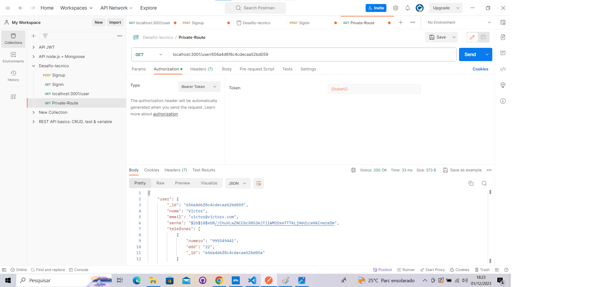

# Projeto de Autenticação de Usuários

Este é um projeto de autenticação de usuários com operações de cadastro, autenticação e recuperação de informações do usuário. A API foi desenvolvida utilizando Node.js, Express e MongoDB. Desafio técnico proposto pela empresa Escribo Inovação para o Aprendizado.

## Configuração do Projeto

1. **Instalação de Dependências:**
   ```bash
   npm install
   ``````
2. **Execução do Projeto:**
    ```bash
   npm start
   `````
# Endpoints da API
- Cadastro de Usuário (Sign Up)

   Endpoint: /signup

   Método: POST

   Exemplo de INPUT:
```bash
{
  "nome": "Nome do Usuário",
  "email": "usuario@email.com",
  "senha": "senha123",
  "telefones": [{"numero":"123445", "ddd": "21"}]
}
   ```
   
*Usuário criado com sucesso*
  

*E-mail já cadastrado*

-  Autenticação de Usuário (Sign In)

   Endpoint: /signin

   Método: POST

   Exemplo de INPUT:

```bash
{
  "email": "usuario@email.com",
  "senha": "senha123"
}
   ```

*Login feito com sucesso*

- Exemplo de OUTPUT:
```bash
{
   "id": "",
   "data_criacao": "",
   "data_visualizao": "",
   "ultimo_login": "",
   "token": ""
}
```
- Exemplo de erro:
```bash

{
    "mensagem": "Usuário e/ou senha inválidos"
}
```

- Buscar Usuário

Endpoint: /user

Método: GET (requer autenticação)

Headers: Authorization: Bearer {token}

*Mensagem de não autorizado por não ter o token*


*Autorizado pelo token, retorna: id, data_criacao, data_atualizacao e token*

# Rota bônus
- Endpoint: /user/:id

   Método: GET (requer autenticação)

   Headers: Authorization: Bearer {token}


*Rota privada, com dados de id específico*

# Estrutura do Projeto
- index.js: Arquivo principal para iniciar o servidor.
- models/user.js: Definição do modelo de usuário para o MongoDB.
- routes/authRoutes.js: Rotas para autenticação e operações de usuário.
- middlewares/authMiddleware.js: Middleware para verificar autenticação.

# Contribuição
Contribuições são bem-vindas! Sinta-se à vontade para abrir um issue ou enviar um pull request.

Projeto realizado com propósito de um desafio-técnico para processo seletivo.